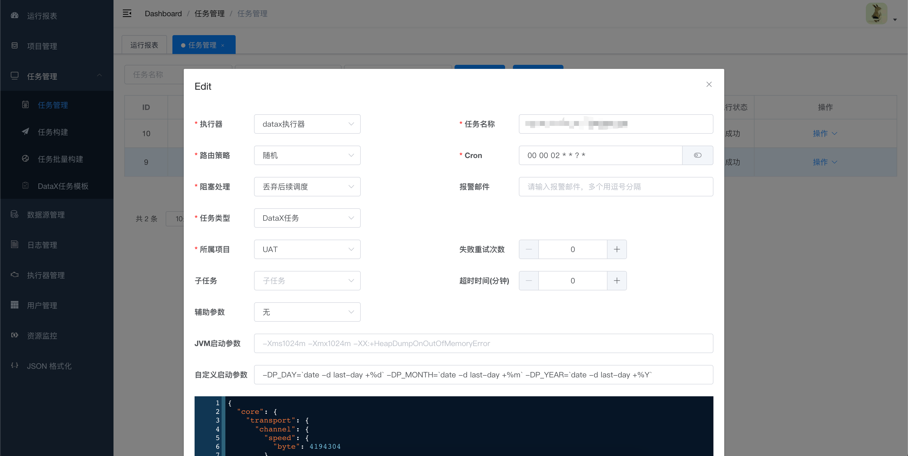

# DataX-Web2

DataX Web2是在DataX Web在Datax之上开发的分布式数据同步工具，提供简单易用的
操作界面，降低用户使用DataX的学习成本，缩短任务配置时间，避免配置过程中出错。用户可通过页面选择数据源即可创建数据同步任务，RDBMS数据源可批量创建数据同步任务，支持实时查看数据同步进度及日志并提供终止同步功能，集成并二次开发xxl-job可根据时间、自增主键增量同步数据。

任务"执行器"支持集群部署，支持执行器多节点路由策略选择，支持超时控制、失败重试、失败告警、任务依赖，执行器CPU.内存.负载的监控等等。后续还将提供更多的数据源支持、数据转换UDF、表结构同步、数据同步血缘等更为复杂的业务场景。

具体可查看[Datax-Web](https://github.com/WeiYe-Jing/datax-web)

## 新增自定义参数

- 示例

  
