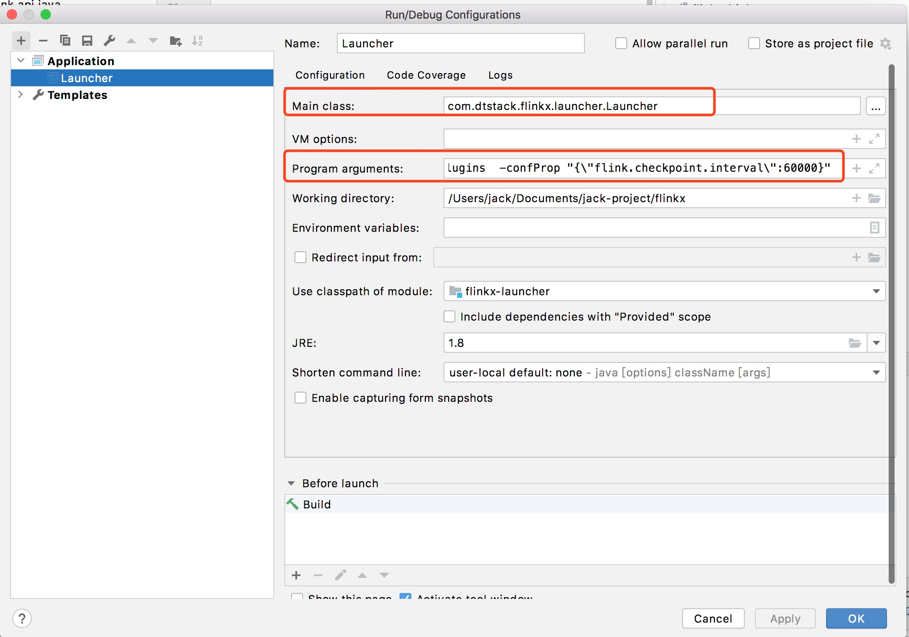
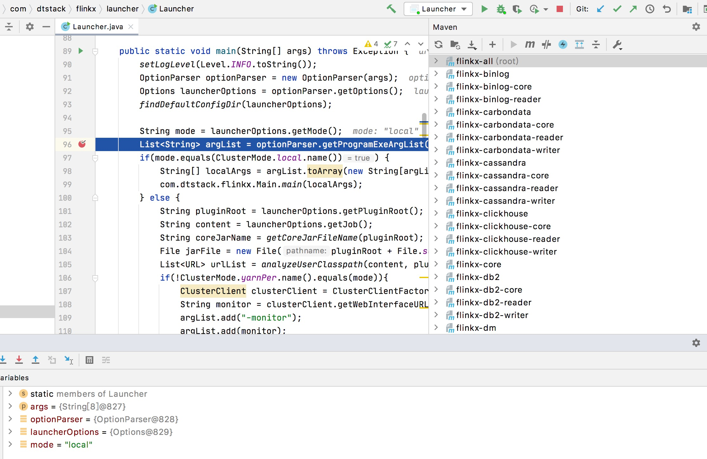
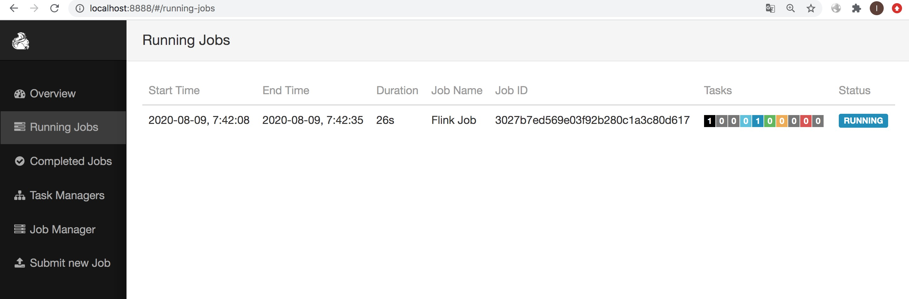

# 在本地对Flinkx进行DEBUG调试

用户在本地进行DEBUG能方便理解FlinkX原理和解决数据同步中出现的异常问题

## 一、前置条件  
1、用户已经按照开始文档要求在本地下载编译好FlinkX源码

## 二、将源码导入IDEA中  
1、在IDEA中file--open--选择FlinkX源码，将项目导入到IDEA中  

## 三、配置DEBUG参数调试FlinkX任务  
1、配置Main Class：
```
com.dtstack.flinkx.launcher.Launcher  
```
2、配置Program arguments：  
```
-mode local  -job /Users/jack/Documents/jack-project/flinkx/flinkconf/mysql2mysql.json   -pluginRoot /Users/jack/Documents/jack-project/flinkx/plugins  -confProp "{\"flink.checkpoint.interval\":60000}"  
```

3、点击apply和Ok


## 四、打断点运行FlinkX任务  


## 五、查看监控页面：http://localhost:8888/  



   