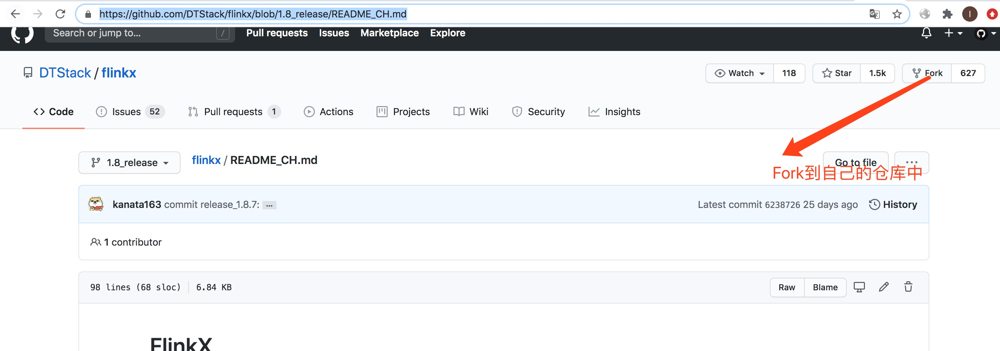

# Flinkx快速开始

[FlinkX](https://github.com/DTStack/flinkx/blob/1.8_release/README_CH.md)  
FlinkX是一个基于Flink的批流统一的数据同步工具，既可以采集静态的数据，比如MySQL，HDFS等，也可以采集实时变化的数据，比如MySQL binlog，Kafka等

## 一、下载
1、前置  
需要安装maven、java8、配置好github相关参数

2、Fork FlinX项目到自己的仓库中  


2、Clone项目到本地  
git clone https://github.com/liukunyuan/flinkx.git

3、安装额外的jar包  
1）、cd flinkx/bin  
2）、执行sh ./install_jars.sh（windows执行install_jars.bat脚本）  

4、打包  
1)、回到flinkx目录：cd ..  
2)、执行打包命令:mvn clean package -Dmaven.test.skip=true  


## 二、快速开始（mysqltomysql）
1、配置flink conf文件（暂时不需要安装flink）  
1)、进入flinkconf目录  
cd flinkconf  
2)、修改flink-conf.yaml文件添加一行  
rest.bind-port: 8888  

2、配置mysqltomysql的json文件,路径:/Users/jack/Documents/jack-project/flinkx/flinkconf/mysql2mysql.json   
```java
{
  "job": {
    "content": [
      {
        "reader": {
          "parameter": {
            "username": "root",
            "password": "password",
            "connection": [{
              "jdbcUrl": ["jdbc:mysql://localhost:3306/test?useUnicode=true&characterEncoding=utf8"],
              "table": ["aa"]
            }],
            "column": ["*"],
            "customSql": "",
            "splitPk": "",
            "queryTimeOut": 1000,
            "requestAccumulatorInterval": 2
          },
          "name": "mysqlreader"
        },
        "writer": {
          "name": "mysqlwriter",
          "parameter": {
            "username": "root",
            "password": "password",
            "connection": [
              {
                "jdbcUrl": "jdbc:mysql://localhost:3306/test?useSSL=false",
                "table": ["bb"]
              }
            ],
            "writeMode": "insert",
            "column": ["aa","bb"],
            "batchSize": 1024
          }
        }
      }
    ],
    "setting": {
      "speed": {
        "channel": 1,
        "bytes": 0
      },
      "errorLimit": {
        "record": 100
      },
      "restore": {
        "maxRowNumForCheckpoint": 0,
        "isRestore": false,
        "restoreColumnName": "",
        "restoreColumnIndex": 0
      },
      "log" : {
        "isLogger": false,
        "level" : "debug",
        "path" : "",
        "pattern":""
      }
    }
  }
}
```
3、运行任务查看执行结果  
nohup /Users/jack/Documents/jack-project/flinkx/bin/flinkx -mode local \
                     -job /Users/jack/Documents/jack-project/flinkx/flinkconf/mysql2mysql.json    \
           -pluginRoot /Users/jack/Documents/jack-project/flinkx/plugins \
           -confProp "{\"flink.checkpoint.interval\":60000}" > log.txt 2>&1 &  
```
---------------------------------
numWrite                  |  2
last_write_num_0          |  0
conversionErrors          |  0
writeDuration             |  20468
duplicateErrors           |  0
numRead                   |  2
snapshotWrite             |  0
otherErrors               |  0
readDuration              |  148
byteRead                  |  47
last_write_location_0     |  0
byteWrite                 |  47
nullErrors                |  0
nErrors                   |  0
---------------------------------

```           